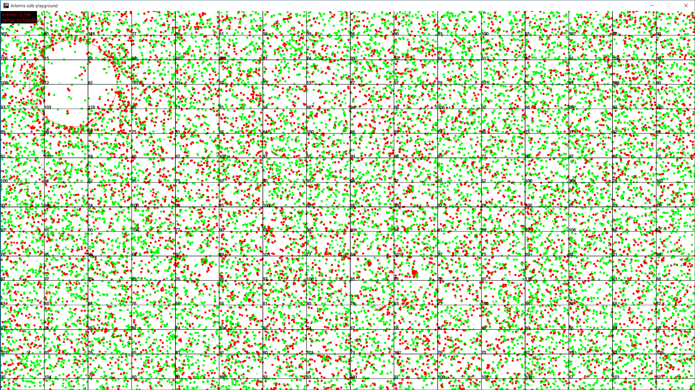

This is a quick and dirty experiment with the artemis odb ecs framework.
I wanted to find out how a proven ecs framework is implemented and used, in
order to compare it to my own implementation.

22k entities, having a particle, a lifetime and a 2d transform component.
Collisions between particles per world cell. Cells udpated per frame.
There is a gravity field and the mouse can be dragged to apply force.

### Usage comparison
Especially adding and removing plugins, systems and entities at runtime of a game are
use cases that have been very tough to implement for me.
Artemis doesn't allow changing plugins and systems at runtime, which makes
the implementation probably a lot simpler, more robust and probably more performant as well.
My implementation modeled a scene as a scope (as in dependency injection framework scope),
so that most resources, like systems and extensions can be scene scoped and share its lifetime.
I don't think that's a good idea anymore, because it makes streaming worlds and resources
unnecessary hard to implement.

### Stress test: iteration 
My experiment spawns a few thousand particles, that have some velocity and collide with each other.
For collision, I implemented a quadtree and only particles within a leaf node collide.
There are also gravity fields, but I didn't implement quadtree queries properly yet, so
gravity fields iterate all quadtree leafs for now and then check against all entities in
a given leaf node. Whenever a particle collided, it's color is switched, so that we can see something :)

### Stress test: removal/insertion
In order to have performant iteration, adding and removing entities at runtime is not trivial to implement.
In my own implementation, I used unsynchronized collections everywhere and seperated iteration
and insertion/removal of entities by scheduling tha latter ones on a single thread pool context
that executes at the beginning of the update step. _onAdd_ and _onRemove_ functionality
can be implemented by every system and that's it. Artemis provides a similar listener mechanism.
Having several dozens of particles, removing them after a lifetime of a few seconds and always add
a new one works reasonably well and doesn't seem to imply any performance problem. So that would
suffice for streaming a world by adding and removing entities.

### Multithreading: iteration
The rendering is done asynchronously, which is one of the things I wanted to try out here - how
does artemis support multithreading (more precisely, how can I implement parallel rendering
and updating). In my own engine, I implemented the extractor pattern and combined it with a 
triple buffer - one is for the update loop, one is the staging state that the render loop will pick
next and the last one is used to render. This way, the synchronization time is as low as it can
get. In this experiment, I only used double buffering and surrounded rendering and extraction
each with the same mutex.

### Multithreading: extraction
Since there is no (good way for) direct memory access on the JVM or a way in artemis to back components
by ByteBuffer instances (packed components, where have you been gone!?) we need to extract
object graphs. Instead of code generation or brittle copy-constructor-functions, I used kryo serialization,
which works very well for data classes like components are. Extracting a few dozen of thousands components
each having two or three components didn't show any performance problem coming up. Converting
those object graphs to gpu friendly direct buffers is a different story though. 

### Multithreading: automatic component extraction
I only want to extract components once, not once in every system. So I first cracked up the artemis package and
implemented an accessor for the raw component arrays of the component mappers. Afterwards,
I used fastclasspath to iterate all component types, created component mappers with the given classes
and wrapped everything up in the extractor system. The double buffering for all components
happens now automatically and both states can be injected and accessed by systems trivially.
